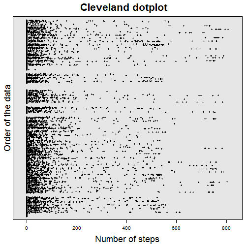

#Background#
This is submitted as part of the Reproducible Research unit of the Coursera Data Science series. The assignment makes use of data from a personal activity monitoring device which collects data at 5 minute intervals throughout the day. The data consists of two months of data from an anonymous individual collected during the months of October and November 2012. Further information is provided about the [Fitbit][1], [Nike Fuelband][2] and [Jawbone up][3].  

##Data source##
The data are available at:  
<https://d396qusza40orc.cloudfront.net/repdata%2Fdata%2Factivity.zip>  
or from the course GitHub site.  

##Code Book##
The dataset is stored in a comma-separated-value (csv) file. There are a total of 17,568 observations.  
The variables included in this dataset are:  
* steps: number of steps taking in a 5-min interval (missing values coded as NA)  
* date: date on which the measurement was taken in YYYY-MM-DD format  
* interval: identifier for the 5-minute interval in which measurement was taken  
---

#Analysis#

##Purpose##
The aim of the analysis is to determine if there are recognisable differences between weekday and weekend daily patterns of activity, imputing missing data as appropriate.  

##Structure##
The steps in the analysis are:  
1.      Downloading and unzipping the csv file (which may be omitted)  
2.      Reading the file into R  
3.      Exploring the data  
4.      Processing the data  
5.      Plotting and calculating various parameters  
6.      Imputing missing values  
7.      Re-calculating the parameters with the updated data  
8.      Comparing the pattern of activity between weekdays and weekends  


Before commencing the analysis, create a folder for the data in the current directory and set it as the working directory (commented out as generally inadvisable to use setwd() in code):    

```r
# if(!file.exists("Activity_Data")) dir.create("Activity_Data")
# setwd("./Activity_Data")
```

Then load the packages required for the analysis (installing them if necessary):     

```r
library(lattice)
```

```
## Warning: package 'lattice' was built under R version 3.2.2
```

```r
library(dplyr)
```

```
## Warning: package 'dplyr' was built under R version 3.2.2
```

```
## 
## Attaching package: 'dplyr'
## 
## The following objects are masked from 'package:stats':
## 
##     filter, lag
## 
## The following objects are masked from 'package:base':
## 
##     intersect, setdiff, setequal, union
```

```r
library(stringr)
```

```
## Warning: package 'stringr' was built under R version 3.2.2
```

```r
library(lubridate)
```

```
## Warning: package 'lubridate' was built under R version 3.2.2
```

```r
library(xtable)
```

```
## Warning: package 'xtable' was built under R version 3.2.2
```

```r
library(ggplot2)
```

```
## Warning: package 'ggplot2' was built under R version 3.2.2
```

```r
library(reshape2)
```

```
## Warning: package 'reshape2' was built under R version 3.2.2
```
---

###Download and unzip the csv file###

```r
# dataset_url <- "https://d396qusza40orc.cloudfront.net/repdata%2Fdata%2Factivity.zip"
# fileDest <- sprintf("activity_%s.zip", format(Sys.time(),"%Y_%m_%d_%H_%M_%S"))
# download.file(dataset_url, fileDest, mode = "wb", method = "libcurl")
# unzip(fileDest)
```

The date of download is included in the name of the zip file for future reference.

###Read in the data and check###

```r
data <- tbl_df(read.csv("activity.csv", stringsAsFactors = FALSE))
str(data)
```

```
## Classes 'tbl_df', 'tbl' and 'data.frame':	17568 obs. of  3 variables:
##  $ steps   : int  NA NA NA NA NA NA NA NA NA NA ...
##  $ date    : chr  "2012-10-01" "2012-10-01" "2012-10-01" "2012-10-01" ...
##  $ interval: int  0 5 10 15 20 25 30 35 40 45 ...
```

The percentage of complete cases, NAs and zeroes (relative to complete cases) respectively:

```r
round(mean(complete.cases(data)), 3) * 100
```

```
## [1] 86.9
```

```r
round(mean(is.na(data$steps)), 3) * 100
```

```
## [1] 13.1
```

```r
round(sum(data$steps == 0, na.rm = TRUE)/nrow(data[!is.na(data$steps), ]), 3) * 100
```

```
## [1] 72.2
```

There were no (obvious) duplicates or negative numbers of steps (data not shown) but there is a significant zero bias.  

###Explore the data###
Look for outliers, NAs, zeroes and the general distribution of the data:

```r
Mydotplot <- function(DataSelected){
        P <- dotplot(as.matrix(as.matrix(DataSelected)),
                     groups = FALSE,
                     strip = FALSE,
                     # strip = strip.custom(bg = 'white',
                     # par.strip.text = list(cex = 1.2)),
                     scales = list(x = list(relation = "free", draw = TRUE),
                                   y = list(relation = "free", draw = FALSE)),
                     col=1, cex  = 0.5, pch = 16,
                     xlab = list(label = "Number of steps", cex = 1.5),
                     ylab = list(label = "Order of the data", cex = 1.5),
                     main = list(label = "Cleveland dotplot", cex = 1.75))
        print(P)  
}
Mydotplot(data$steps)
```

 

Note the wide range, skew, missing values and preponderance of zeroes:  

```r
histogram(data$steps,
          nint = 40, 
          xlab = list(label = "Number of Steps", cex = 1.5),
          ylab = list(label = "Percent of Total", cex = 1.5),
          main = list(label = "Frequency Histogram", cex = 1.75))
```

 

The data appear to be over-distributed. This suggests that a log transformation (adding 1 in view of zeroes) may be useful:  

```r
plot(log10(data$steps +1) ~ as.POSIXct(data$date), xlab = "Date")
title(main = "Log transformation")
```

 

or a square root transformation:  

```r
plot(sqrt(data$steps) ~ as.POSIXct(data$date), xlab = "Date")
title(main = "Square root transformation")
```

 

However there are problems with both approaches, so I opted to leave the data untransformed.

###Process the data###
Create new variables for Date, day of week (Mon-Sun) and weekday/weekend:  

```r
data <- mutate(data, Date = as.Date(date)) %>%
        mutate(DayOfWeek = factor(weekdays(Date),
                levels = c("Monday", "Tuesday", "Wednesday", "Thursday", "Friday", "Saturday", "Sunday"),
                labels = c("Mon", "Tue", "Wed", "Thu", "Fri", "Sat", "Sun")))
data$WeekDay[which(data$DayOfWeek %in% c("Mon", "Tue", "Wed", "Thu", "Fri"))] <- "Weekday"
data$WeekDay[which(data$DayOfWeek %in% c("Sat", "Sun"))] <- "Weekend"
```

Note that the interval variable is actually a time variable.
Create new variables for time and date.time:  

```r
data$time <- str_pad(data$interval, width = 4, "left", pad = "0")
data$date.time <- paste(data$date, data$time, sep = " ")
data$date.time <- ymd_hm(data$date.time)
```

date.time is now class POSIXct; however, for the purposes of the analysis interval suffices.

###Plot and calculate various parameters###
Plot the total daily steps:  

```r
dailyData <- group_by(data, Date) %>%
        summarise(Total_Steps = sum(steps, na.rm = TRUE)) %>%
        plot(type = "h",
             xlab = "Consecutive Days", ylab = "Number of Steps",
             main = "Total Daily Steps (using original data)")
```

 

Note that some days have no readings. It appears as if the monitors failed on those days so they have been excluded from the analysis for the time being. This "missingness" is an odd pattern, apparently covering whole 24 hour periods. 

Calculate the total/mean/median of the daily total number of steps (excluding days with no data):  

```r
summaryData1 <- group_by(data, Date) %>%
        summarise(Total_Steps = sum(steps, na.rm = TRUE)) %>%
        filter(Total_Steps != 0) %>%
        summarise(Grand_Total_Steps = sum(Total_Steps),
                  Average_Steps = round(mean(Total_Steps), 0),
                  Median_Steps = round(median(Total_Steps), 0))
print(summaryData1)
```

```
## Source: local data frame [1 x 3]
## 
##   Grand_Total_Steps Average_Steps Median_Steps
##               (int)         (dbl)        (dbl)
## 1            570608         10766        10765
```

```r
xt1 <- xtable(summaryData1)
print(xt1, type = "html")
```

```
## <!-- html table generated in R 3.2.1 by xtable 1.8-0 package -->
## <!-- Wed Dec 16 21:48:03 2015 -->
## <table border=1>
## <tr> <th>  </th> <th> Grand_Total_Steps </th> <th> Average_Steps </th> <th> Median_Steps </th>  </tr>
##   <tr> <td align="right"> 1 </td> <td align="right"> 570608 </td> <td align="right"> 10766.00 </td> <td align="right"> 10765.00 </td> </tr>
##    </table>
```

Calculate and plot the mean number of steps per interval:  

```r
interval_Data <- group_by(data, interval) %>%
        select(steps) %>%
        summarise(Mean_Steps = mean(steps, na.rm = TRUE))
qplot(interval, Mean_Steps, data = interval_Data,
      geom = "line",
      main = "Time series of mean steps per 5 min interval over 24 hours")
```

 

Find time interval with highest mean number of steps and corresponding time (24h clock):  

```r
which(interval_Data$Mean_Steps == max(interval_Data$Mean_Steps))
```

```
## [1] 104
```

```r
max_activity <- interval_Data$interval[which(interval_Data$Mean_Steps == 
                                                     max(interval_Data$Mean_Steps))]
print(str_pad(max_activity, width = 4, "left", pad = "0"))
```

```
## [1] "0835"
```

###Impute missing values###
Number of missing values (NAs):

```r
sum(is.na(data$steps))
```

```
## [1] 2304
```

Pattern of missing values:

```r
dailyNAs <- group_by(data, Date) %>%
        summarise(NAs = sum(is.na(steps)))
barplot(dailyNAs$NAs, xlab = "Consecutive Days", ylab = "Number of NAs")
title(main = "Pattern of Missing Values by Day")
```

 

As noted previously the pattern indicates that all readings for certain days are missing. This makes it difficult to use various forms of imputation (such as "nearest neighbour" or "next available" formulae) and suggests that profiling of similar days should be used.

The specific days with missing values are:

```r
NA_indices <- which(dailyNAs$NAs > 0)
NA_days <- filter(dailyNAs, NAs > 0)
print(NA_days)
```

```
## Source: local data frame [8 x 2]
## 
##         Date   NAs
##       (date) (int)
## 1 2012-10-01   288
## 2 2012-10-08   288
## 3 2012-11-01   288
## 4 2012-11-04   288
## 5 2012-11-09   288
## 6 2012-11-10   288
## 7 2012-11-14   288
## 8 2012-11-30   288
```

All weekdays are represented except Tuesdays:

```r
missing_data <- data[which(!complete.cases(data)), ]
unique(missing_data$DayOfWeek)
```

```
## [1] Mon Thu Sun Fri Sat Wed
## Levels: Mon Tue Wed Thu Fri Sat Sun
```

To identify if there is a discernible pattern in different days:
 

No obvious pattern is apparent. However a time series may be more helpful.  

Select the complete cases and transform into 'wide' format:    

```r
complete_data <- data[which(complete.cases(data)), ]
wide_date1 <- acast(complete_data, interval ~ date, value.var = "steps")
wide_DayOfWeek1 <- acast(complete_data, interval ~ DayOfWeek,
                        value.var = "steps", fun.aggregate = sum)
wide_WeekDay1 <- acast(complete_data, interval ~ WeekDay,
                      value.var = "steps", fun.aggregate = sum)
```

Plot the time series by day of the week (Mon - Sun):

```r
Day_Of_Week1 <- ts(wide_DayOfWeek1)
plot(Day_Of_Week1)
```

 

There does not appear to be an obvious pattern.

Plot the time series by weekday (weekday vs weekend):

```r
Week_Day1 <- ts(wide_WeekDay1)
plot(Week_Day1)
```

 

There appears to be a difference (ie later onset and cessation of activity during weekends and more even distribution). This suggests that profiles of activity for weekdays (M-F) and weekends (S-S) could be used for imputation of missing values.

Create weekday vs weekend profiles using complete data, calculate the median number of steps in each interval, add a new variable (join\_id) and combine into single dataframe (imputed\_profile):  

```r
Weekday_profile <- complete_data %>%
        filter(WeekDay == "Weekday") %>%
        group_by(interval) %>%
        summarise(Median_Steps = round(median(steps), 0)) %>%
        mutate(join_id = paste("Weekday", interval))
Weekend_profile <- complete_data %>%
        filter(WeekDay == "Weekend") %>%
        group_by(interval) %>%
        summarise(Median_Steps = round(median(steps), 0)) %>%
        mutate(join_id = paste("Weekend", interval))
imputed_profile <- rbind(Weekday_profile, Weekend_profile)
```

Create corresponding join\_id in data and join to imputed\_profile:  

```r
data <- mutate(data, join_id = paste(WeekDay, interval))
data_imputed <- left_join(data, imputed_profile, by = "join_id")
```

Create new dataset with steps\_imputed variable instead of steps:  

```r
data_imputed <- mutate(data_imputed, 
                       steps_imputed = ifelse(is.na(steps), Median_Steps, steps)) %>%
        mutate(WeekDay = as.factor(WeekDay)) %>%
        select(interval.x, date, Date, steps_imputed, DayOfWeek, WeekDay) %>%
        rename(interval = interval.x)
```

###Re-calculate the parameters and re-plot with the updated data###
Re-plot the total daily steps with new dataset:  

```r
dailyData <- group_by(data_imputed, Date) %>%
        summarise(Total_Steps = sum(steps_imputed)) %>%
        plot(type = "h",
             xlab = "Consecutive Days", ylab = "Number of Steps",
             main = "Total Daily Steps (using imputed data)")
```

 

There are still a significant number of days with suspiciously low numbers of steps. In the absence of an explanation for this the data have not been excluded.

Re-calculate the mean/median of the daily total number of steps with imputed data:  

```r
summaryData2 <- group_by(data_imputed, Date) %>%
        summarise(Total_Steps = sum(steps_imputed)) %>%
        summarise(Grand_Total_Steps = sum(Total_Steps),
                  Average_Steps = round(mean(Total_Steps), 0),
                  Median_Steps = round(median(Total_Steps), 0))
print(summaryData2)
```

```
## Source: local data frame [1 x 3]
## 
##   Grand_Total_Steps Average_Steps Median_Steps
##               (dbl)         (dbl)        (dbl)
## 1            582382          9547        10395
```

```r
xt2 <- xtable(summaryData2)
print(xt2, type = "html")
```

```
## <!-- html table generated in R 3.2.1 by xtable 1.8-0 package -->
## <!-- Wed Dec 16 21:48:04 2015 -->
## <table border=1>
## <tr> <th>  </th> <th> Grand_Total_Steps </th> <th> Average_Steps </th> <th> Median_Steps </th>  </tr>
##   <tr> <td align="right"> 1 </td> <td align="right"> 582382.00 </td> <td align="right"> 9547.00 </td> <td align="right"> 10395.00 </td> </tr>
##    </table>
```

Compare grand total, mean and median steps with original and imputed data:  

```r
summaryData3 <- rbind(summaryData1, summaryData2)
row.names(summaryData3) <- c("Original data (excl days with zero steps)", "Imputed data")
print(summaryData3)
```

```
## Source: local data frame [2 x 3]
## 
##   Grand_Total_Steps Average_Steps Median_Steps
##               (dbl)         (dbl)        (dbl)
## 1            570608         10766        10765
## 2            582382          9547        10395
```

```r
xt3 <- xtable(summaryData3)
print(xt3, type = "html")
```

```
## <!-- html table generated in R 3.2.1 by xtable 1.8-0 package -->
## <!-- Wed Dec 16 21:48:04 2015 -->
## <table border=1>
## <tr> <th>  </th> <th> Grand_Total_Steps </th> <th> Average_Steps </th> <th> Median_Steps </th>  </tr>
##   <tr> <td align="right"> Original data (excl days with zero steps) </td> <td align="right"> 570608.00 </td> <td align="right"> 10766.00 </td> <td align="right"> 10765.00 </td> </tr>
##   <tr> <td align="right"> Imputed data </td> <td align="right"> 582382.00 </td> <td align="right"> 9547.00 </td> <td align="right"> 10395.00 </td> </tr>
##    </table>
```

###Compare the pattern of activity between weekdays and weekends with imputed data###
Plot using time series function:

```r
wide_WeekDay2 <- acast(data_imputed, interval ~ WeekDay,
                       value.var = "steps_imputed", fun.aggregate = sum)
Weekend_Activity_Comparison <- ts(wide_WeekDay2)
plot(Weekend_Activity_Comparison)
```

 

The pattern seen with the original data is reproduced with the inclusion of imputed data. Activity at the weekends begins later, is more consistent and ends later.

---
On completion, reset current working directory to initial wd (optional):

```r
# setwd("../")
```

---

[1]: http://www.fitbit.com/ "Fitbit"
[2]: http://www.nike.com/us/en_us/c/nikeplus-fuelband "Nike Fuelband"
[3]: https://jawbone.com/up "Jawbone up"
